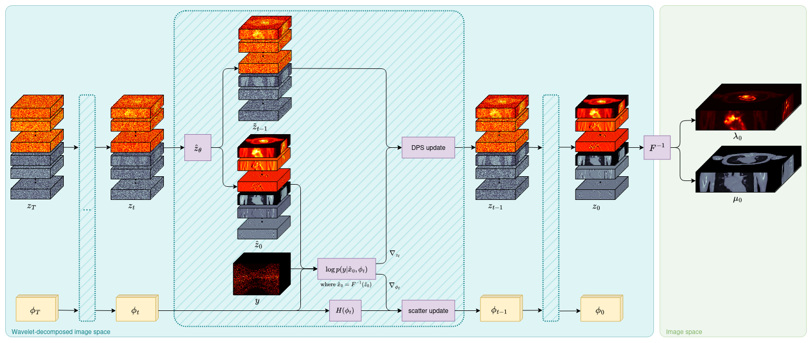

# JRAA-DPS: Joint Reconstruction of Activity and Attenuation using Diffusion Posterior Sampling 



This repository contains PyTorch code for the preprint **"Joint Reconstruction of Activity and Attenuation in PET by Diffusion Posterior Sampling in Wavelet Coefficient Space"** (2025) [[arXiv link]](https://arxiv.org/abs/2505.18782)

If you use this code in your research, please consider citing:
```bibtex
@article{phung2025joint,
  title={Joint Reconstruction of Activity and Attenuation in PET by Diffusion Posterior Sampling in Wavelet Coefficient Space},
  author={Phung-Ngoc, Cl{\'e}mentine and Bousse, Alexandre and De Paepe, Antoine and Merlin, Thibaut and Laurent, Baptiste and Dang, Hong-Phuong and Saut, Olivier and Visvikis, Dimitris},
  journal={arXiv preprint arXiv:2505.18782},
  year={2025}
}
```

## Installation

```
conda env create -f environment.yml
conda activate jraadpsenv
```

## Data

Data is preprocessed from `DICOM` patient files into 128x256x256 volumes stored in `.npy` format for easy dataloading with `ActivityAttenuationDataset`.

## Training

```
python train.py \
    --data configs/data.yml \
    --model configs/model.yml \
    --train configs/train.yml
```

## Sampling

```
python reconstruct.py \
    --data configs/data.yml \
    --model configs/model.yml \
    --proj configs/projector.yml \
    --infer configs/inference.yml
```

## Acknowledgments

Code is base on the following repositories:
- [https://github.com/pfriedri/wdm-3d](https://github.com/pfriedri/wdm-3d).
